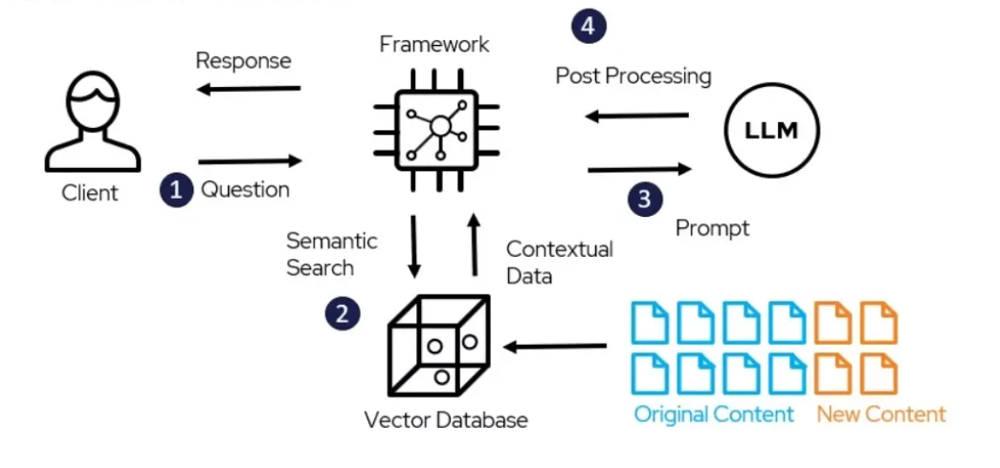

# Chat with Your PDF Using LLM 🔗🤖


## 📖 Overview 
This project demonstrates how to create a chat interface with a PDF document using the powerful LangChain library. By integrating techniques such as text loading, splitting, embedding, and vector storage, this project enables advanced querying of the text. Additionally, it showcases how to implement Retrieval-Augmented Generation (RAG) chains to provide detailed, context-aware responses. Whether you're looking to build a document assistant or just experiment with LLMs, this project has you covered!


## ✨ Features 
- **Text Loading**: Load text from a `.txt` file.
- **Text Splitting**: Split text into manageable chunks.
- **Embedding & Vector Storage**: Create embeddings for the text and store them in a vector database.
- **Querying**: Use Language Models (LLMs) to answer queries based on the text.
- **Retrieval-Augmented Generation (RAG)**: Implement custom RAG chains for advanced querying.

## 🛠️ Requirements
- Python 3.9+
- LangChain
- langchain_community
- langchain_text_splitters
- langchain_openai
- langchain_chroma
- dotenv

Install the required packages using `pip`:

```bash
pip install langchain langchain_community langchain_text_splitters langchain_openai langchain_chroma python-dotenv
```

## 🚀 Setup

1. **Clone the Repository:**

   ```bash
   git clone https://github.com/n-mhatre/Chat-with-Your-PDF-Using-LLM.git
   
   cd react-agent-langchain
2. **Environment Variables:**    
    Create a `.env.secret` file in the project root directory with your OpenAI API key:
    ```bash
   OPENAI_API_KEY=your_openai_api_key
3. **Prepare the PDF Document: 📝**
    Save your PDF content as a text file named `blog.txt` in the root directory.

## 🧑‍💻 Code Overview
1. **Load and Split Text: 📜**
</br>This step involves loading the text from the file and splitting it into smaller, manageable chunks for easier processing.
    
    ```
    loader = TextLoader('blog.txt')
    document = loader.load()

    text_splitter = RecursiveCharacterTextSplitter(chunk_size=500, chunk_overlap=50)
    documents = text_splitter.split_documents(document)
    ```
</br>

2. **Embed Text and Store in Vector Database: 🗄️**
    </br>Once the text is split, embeddings are created and stored in a vector database for efficient retrieval.
    
    ```
    vector_db = Chroma.from_documents(documents, OpenAIEmbeddings(), persist_directory="./chroma_db_blog")
    ```

</br>

3. **RAG Using LangChain: 🔄**
    </br>This code demonstrates how to set up a basic RAG chain using LangChain to query the document.
    
    ```
    retriever = vector_db.as_retriever()
    combine_docs_chain = create_stuff_documents_chain(llm, qa_prompt)
    retrieval_chain = create_retrieval_chain(
        retriever=retriever, combine_docs_chain=combine_docs_chain
    )
    query = 'Summarize the research paper of me.'
    result = retrieval_chain.invoke(input={"input": query})
    ```
</br>

4. **Custom RAG Chain: ⚙️**
    </br>For more complex querying, a custom RAG chain can be set up to tailor the responses.
    
    ```
    custom_rag_prompt = PromptTemplate(template=template)
    retriever = vector_db.as_retriever()

    custom_chain = {'context': retriever | format_docs, 'question': RunnablePassthrough()} | custom_rag_prompt | llm
    query = 'explain me the example given in the blog'
    result = custom_chain.invoke(query)
    ```


## 🙏 Acknowledgments
I would like to extend our heartfelt thanks to the open-source community and contributors who have developed and maintained the LangChain library and its associated tools. Their dedication and innovation have made it possible to explore the exciting possibilities of language models and document processing. Special thanks to the developers behind the integration of LLMs with vector databases, which has significantly enhanced the capabilities of this project. Your work continues to inspire and empower developers worldwide.